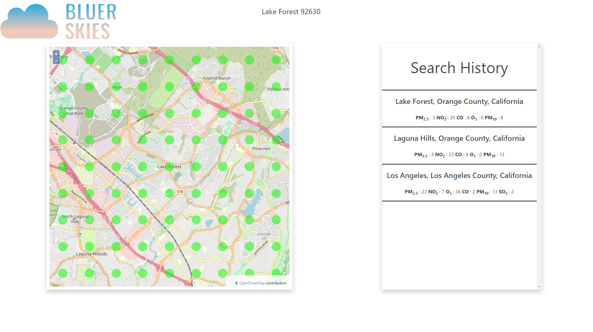

# bluerSkies

This website displays a scrollable map with a grid of colored points representing fine particle pollution levels. 
It uses (quasi) unlimited free APIs. 

Try it out here: 
<a href="https://benw10-1.github.io/bluerSkies/">https://benw10-1.github.io/bluerSkies/</a><b>

Contributors:

<a href="https://github.com/lewisemarcus">lewisemarcus</a> 
<a href="https://github.com/nialvo">nialvo</a> 
<a href="https://github.com/KJustin03">KJustin03</a> 
<a href="https://github.com/Ozerpa">Ozerpa</a> 
<a href="https://github.com/benw10-1">benw10-1</a> 

